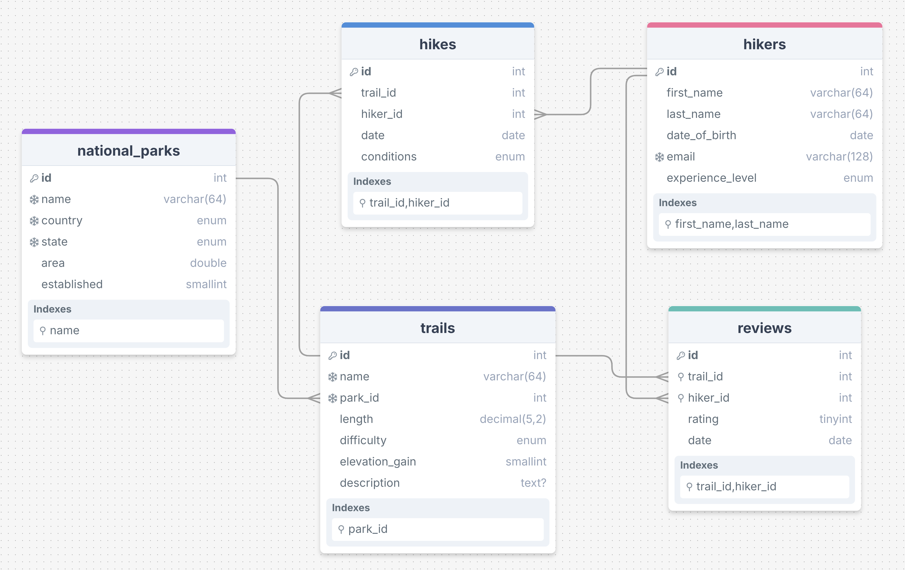
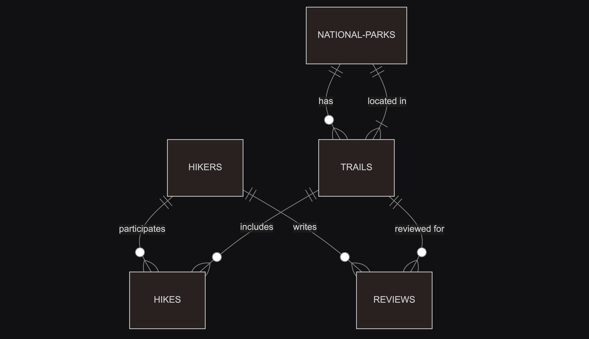

# Design | TrailHub Database

*By Thomas Moesl | Date: 2024-11-18 | [Database Video Showcase](https://youtu.be/zQm1ip0P9KE)*

## Introduction
This project implements a MySQL database to manage hiking activities, trail reviews, and national park information.
It features optimized indexing, structured relationships, and views to streamline data exploration and enhance query efficiency.
The dataset, sourced from authentic AllTrails resources, ensures comprehensive and accurate information for analysis.

## Scope
The database for TrailHub facilitates efficient tracking of hikers, trails, hikes, and reviews. It includes the following entities within its scope:

- `hikers`: Capturing essential personal and skill-related details.
- `national_parks`: Including park names, locations, areas, and establishment years.
- `trails`: Providing information on trail attributes like length, difficulty, and descriptions.
- `hikes`: Logging hiking activities with conditions and dates.
- `reviews`: Recording trail ratings and feedback from hikers.

**Note:** Elements like permit management and advanced trail analytics are out of scope for this version.

## Functional Requirements
This `MySQL` database supports:

- CRUD operations for hikers, trails, national parks, hikes, and reviews.
- Tracking hiking activities, including trail conditions, dates, and aggregated data such as hikes per year or recent hikes.
- Managing trail reviews with ratings, feedback, and popularity rankings.
- Advanced querying, including filtering trails by park or difficulty, and identifying frequent hikers and popular trails.

## Representation
Entities are implemented as MySQL tables with the following schema.

***Legend**: Key (primary key), Snowflake (unique values), Location (index)*

### Hikers Table
The `hikers` table includes:
- `id`: Unique identifier for each hiker (`INT`, `PRIMARY KEY`)
- `first_name`: Hiker’s first name (`VARCHAR(64)`), indexed for efficient querying
- `last_name`: Hiker’s last name (`VARCHAR(64)`), indexed for efficient querying
- `date_of_birth`: Hiker’s date of birth (`DATE`)
- `email`: Unique email address for each hiker (`VARCHAR(128)`, `UNIQUE`)
- `experience_level`: Hiker’s skill level (`ENUM` with values 'Beginner', 'Intermediate', 'Advanced', 'Professional')​

All columns are required and therefore have the `NOT NULL` constraint applied, except for the `id` primary key to avoid redundancy. Additionally, `email` has a `UNIQUE` constraint to prevent duplicates.

### National Parks
The `national_parks` table includes:
- `id`: Unique identifier for each national park (`INT`, `PRIMARY KEY`)
- `name`: Name of the national park (`VARCHAR(64)`), indexed for efficient querying
- `country`: Country where the park is located (`ENUM` with value 'USA')
- `state`: State where the park is located (`ENUM`, US states abbreviations)
- `area`: Area of the park in square kilometers (`DOUBLE`)
- `established`: Year the park was established (`SMALLINT`)

All columns are required and therefore have the `NOT NULL` constraint applied, except for the `id` primary key to avoid redundancy. The combination of `name`, `country`, and `state` has a `UNIQUE` constraint to ensure uniqueness.

### Trails
The `trails` table includes:
- `id`: Unique identifier for each trail (`INT`, `PRIMARY KEY`)
- `name`: Name of the trail (`VARCHAR(64)`), unique within each park
- `park_id`: Identifier for the park containing the trail (`INT`, `FOREIGN KEY` referencing `national_parks(id)`)
- `length`: Length of the trail in kilometers (`DECIMAL(5,2)`)
- `difficulty`: Difficulty level of the trail (`ENUM` with values 'Easy', 'Moderate', 'Hard')
- `elevation_gain`: Elevation gain of the trail in meters (`SMALLINT`)
- `description`: Detailed description of the trail (`TEXT`)

All columns are required and therefore have the `NOT NULL` constraint applied, except for the `id` primary key to avoid redundancy and the `description` column, which can be `NULL`. The combination of `name` and `park_id` has a `UNIQUE` constraint.

### Hikes
The `hikes` table includes:
- `id`: Unique identifier for each hike (`INT`, `PRIMARY KEY`)
- `trail_id`: Identifier for the trail hiked (`INT`, `FOREIGN KEY` referencing `trails(id)`)
- `hiker_id`: Identifier for the hiker (`INT`, `FOREIGN KEY` referencing `hikers(id)`)
- `date`: Date of the hike (`DATE`)
- `conditions`: Weather conditions during the hike (`ENUM` with values 'Sunny', 'Cloudy', 'Rainy', 'Snowy')

All columns are required and therefore have the `NOT NULL` constraint applied, except for the `id` primary key to avoid redundancy.

### Reviews
The `reviews` table includes:
- `id`: Unique identifier for each review (`INT`, `PRIMARY KEY`)
- `trail_id`: Identifier for the trail being reviewed (`INT`, `FOREIGN KEY` referencing `trails(id)`)
- `hiker_id`: Identifier for the hiker who submitted the review (`INT`, `FOREIGN KEY` referencing `hikers(id)`)
- `rating`: Rating given to the trail (`TINYINT` between 1 and 5)
- `date`: Date of the review (`DATE`)

All columns are required and therefore have the `NOT NULL` constraint applied, except for the `id` primary key to avoid redundancy. The combination of `hiker_id` and `trail_id` has a `UNIQUE` constraint to prevent duplicate reviews.

## Relationships
The relationships between the entities are captured in the entity-relationship (ER) diagram:

As detailed by the ER diagram:

- **A hiker can participate in 0 to many hikes:** 0 if they have not gone on any hikes, and many if they complete multiple hikes. Each hike is linked to one hiker.
- **A hike includes one trail, while a trail can have 0 to many hikes:** 0 if no hikers have completed the trail, and many if multiple hikers have hiked the same trail.
- **A trail is located in one national park, whereas a national park can have 0 to many trails:** 0 if no trails are defined for the park, and many if the park contains multiple trails.
- **A review is associated with one trail, while a trail can have 0 to many reviews:** 0 if no hikers have reviewed the trail, and many if multiple hikers provide reviews for the same trail.
- **A review is written by one hiker, while a hiker can write 0 to many reviews:** 0 if they have not reviewed any trails, and many if they have reviewed multiple trails.

## Views
The views in the database are designed to simplify complex queries by consolidating related data, enabling efficient tracking of hikes, reviews, and trail details within national parks.

`hiker_activity`
- Consolidates information about hikes, linking hikers, trails, and hiking details (e.g., conditions and dates).
- Facilitates queries to track hikers’ activities and trail usage efficiently.

`trail_reviews_details`
- Combines review details with information about trails, parks, and hikers.
- Enables analysis of trail feedback, such as average ratings and reviewer demographics.

`national_park_trails_details`
- Lists trails within each national park, including their attributes (length, difficulty, elevation gain).
- Simplifies retrieval of park-specific trail details for user exploration or management.

## Optimizations
Per the typical queries in queries.sql, users frequently retrieve information about hikes, trails, and reviews based on criteria like hiker names, trail names, and park names. The following indexes are designed to optimize these queries:

`idx_hikers_full_name`: Enhances the performance of queries that identify hikers using their first and last names.

`idx_national_parks_name`: Speeds up queries that search for national parks by their name.

`idx_trails_park_id`: Optimizes the retrieval of trails linked to specific national parks.

`idx_hikes_hiker_id`: Improves the efficiency of querying hiking activities by hiker.

`idx_hikes_trail_id`: Enhances the performance of queries that retrieve hiking activities by trail.

`idx_reviews_hiker_id`: Facilitates efficient linking of reviews to specific hikers.

`idx_reviews_trail_id`: Speeds up queries that associate reviews with specific trails.

## Limitations
The current database schema assumes:

1. Trails belong to one national park (no shared trails).
2. Individual hiking activities and reviews (no group activities or collaborative reviews).

Future iterations could expand functionality to include features like permits and trail statistics for advanced analytics.

---
